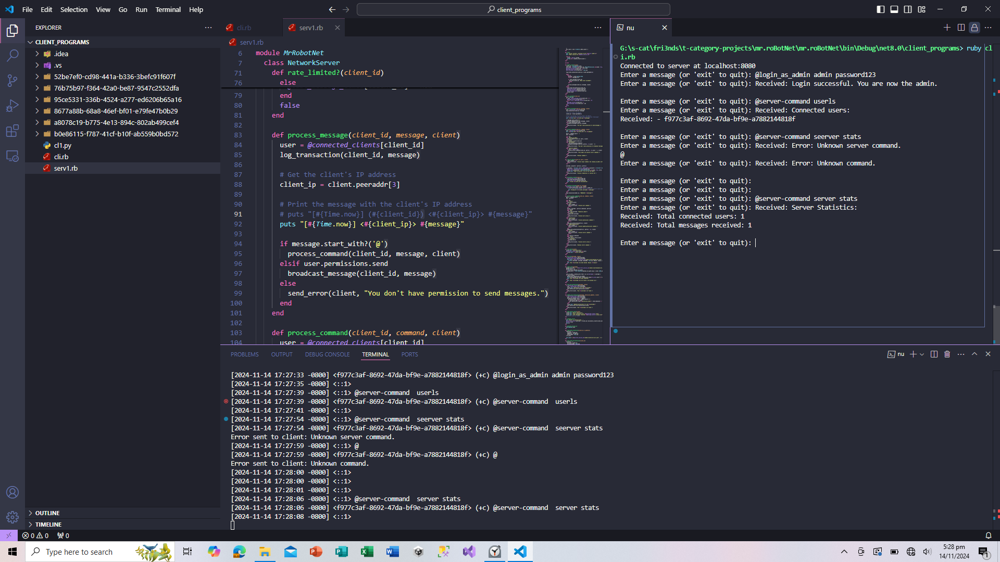

<div align="center">
    <h1>Simple Server & Client Tcp chat server in ruby.</h1>
</div>



# `Features`

- Gracefull starting of the `server`.
- Session management and `transations saving`.
- Login to the server, via `authorized username and password`.
- Access server comtrols after `login`, and control the entire `tcp server.`
- `Ban and UnBan` users from your server.
- See and Update `user permissions`, make them admin, or discard them.
- Check `server stats` whenever you want.
- `Broadcast` a message to other users.
- `Detailed logging` on server side.
- A `custom built prompt` on client side.
- A gracefull `Error handling` system.
- Gracefull closing.

# `Info`

- ## **Made in ruby:**
```
G:> ruby -v                                                                                     
ruby 3.3.5 (2024-09-03 revision ef084cc8f4) [x64-mingw-ucrt]
```

- ## **Contents:**
```
G:> ls                                               
╭───┬──────────────┬──────┬───────────┬────────────────╮
│ # │     name     │ type │   size    │    modified    │
├───┼──────────────┼──────┼───────────┼────────────────┤
│ 0 │ .idea        │ dir  │       0 B │ a month ago    │
│ 1 │ .vs          │ dir  │       0 B │ a month ago    │
│ 2 │ README.md    │ file │     937 B │ 2 minutes ago  │
│ 3 │ Untitled.png │ file │ 233.0 KiB │ 10 minutes ago │
│ 4 │ cl1.py       │ file │   3.6 KiB │ a month ago    │
│ 5 │ cli.rb       │ file │   2.6 KiB │ a month ago    │
│ 6 │ serv1.rb     │ file │  12.0 KiB │ 12 minutes ago │
╰───┴──────────────┴──────┴───────────┴────────────────╯  
```

- ## Author: **hmZa-Sfyn** <`https://github.com/hmZa-Sfyn`>
- ## MIT - `Do whatever you want`