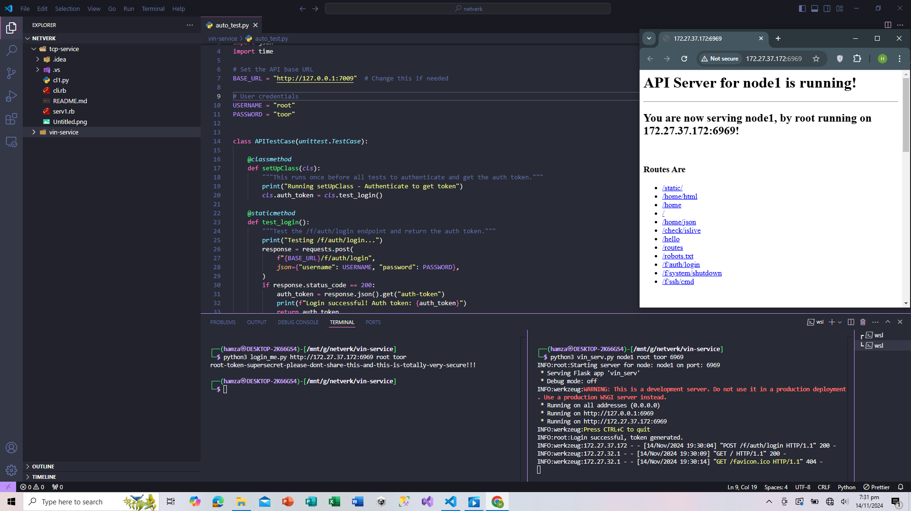
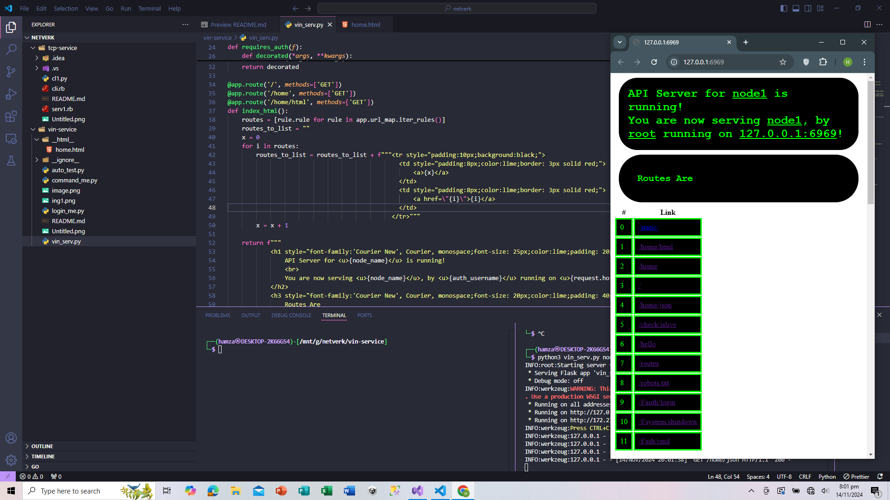
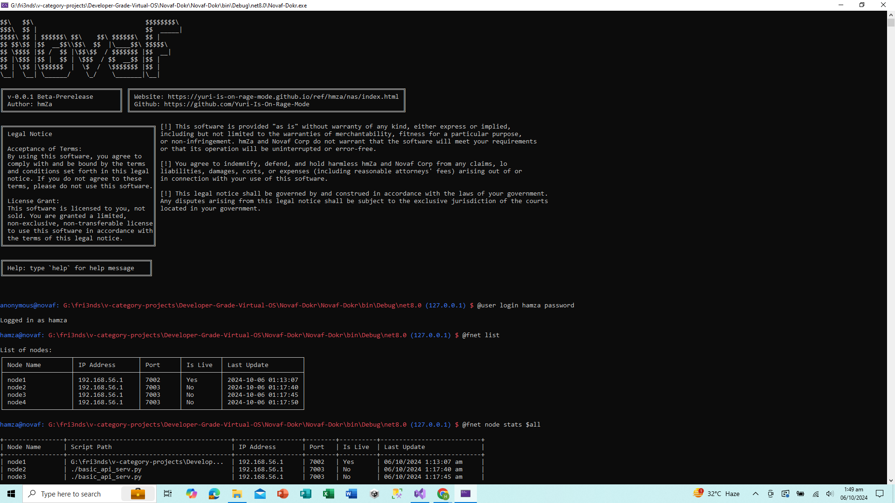
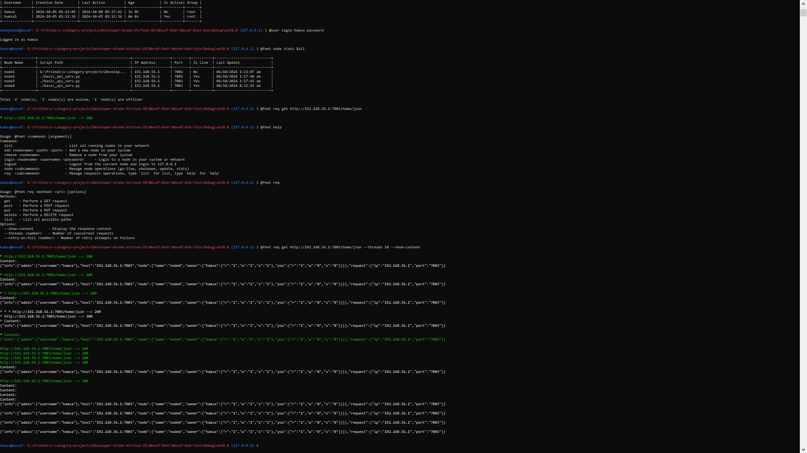

<div align="center">
    <h1>Simple API app written in python.</h1>
</div>



# `Features`

- Server hosted on both, `developer Os` and `LAN` network.
    ```
    * Running on all addresses (0.0.0.0)
    * Running on http://127.0.0.1:6969
    * Running on http://172.27.37.172:6969
    ```
    
- Server built with `flask` and `werkzeug`.
    ```
    ┌──(hamza㉿DESKTOP-2K66GS4)-[/mnt/g/netverk/vin-service]
    └─$ python3 vin_serv.py node1 root toor 6969
    INFO:root:Starting server for node: node1 on port: 6969
    * Serving Flask app 'vin_serv'
    * Debug mode: off
    INFO:werkzeug:WARNING: This is a development server. Do not use it in a production deployment. Use a production WSGI server instead.
    * Running on all addresses (0.0.0.0)
    * Running on http://127.0.0.1:6969
    * Running on http://172.27.37.172:6969
    INFO:werkzeug:Press CTRL+C to quit
    INFO:root:Login successful, token generated.
    ```
- Server with `custom ssh` capablity and can communicate with eachother.
    
- Server with a fully managed `Client Auth` system.
    ```
    INFO:root:Login successful, token generated.
    ```
- Server with `fnet` related `APIs`.
    

# `Info`

- ## **Made in python3:**
```
┌──(hamza㉿DESKTOP-2K66GS4)-[/mnt/g/netverk/vin-service]
└─$ python3 -V
Python 3.11.9
```

- ## **Contents:**
```
┌──(hamza㉿DESKTOP-2K66GS4)-[/mnt/g/netverk/vin-service]
└─$ ls -l -a
total 232
drwxrwxrwx 1 hamza hamza    512 Nov 14 19:31 .
drwxrwxrwx 1 hamza hamza    512 Nov 14 19:18 ..
-rwxrwxrwx 1 hamza hamza   2742 Nov 14 19:29 auto_test.py
-rwxrwxrwx 1 hamza hamza    697 Nov 14 19:28 command_me.py
drwxrwxrwx 1 hamza hamza    512 Nov 14 19:19 __ignore__
-rwxrwxrwx 1 hamza hamza    751 Oct  9 08:12 login_me.py
-rwxrwxrwx 1 hamza hamza      0 Nov 14 19:31 README.md
-rwxrwxrwx 1 hamza hamza 214386 Nov 14 19:31 Untitled.png
-rwxrwxrwx 1 hamza hamza   4974 Nov 14 19:25 vin_serv.py 
```

- ## Author: **hmZa-Sfyn** <`https://github.com/hmZa-Sfyn`>
- ## MIT - `Do whatever you want`